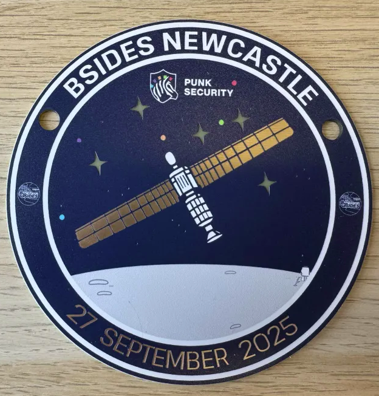
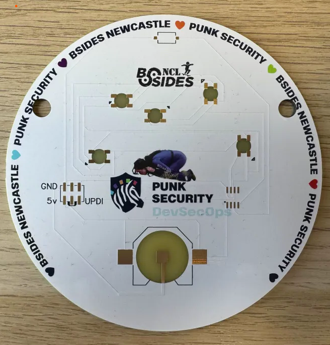

# bsides-newcastle-2025-badge
The space badge for BSIDES Newcastle 2025!

This badge is a bit like our other ones, such as Cheltenham 2024 which was also a morse code game.

For this one, we printed some signs out with the codes for the players and stuck them around the venue. We really wanted to do a more art focused badge, so we didnt try any new technical gimmicks. The satellite you see on the badge was traced using the Angel of the North, which is a northern landmark near Newcastle. All the signs we made are in the signs directory. The morse code guide is included here too, as manual.png and manual.psd

The badge was made using our standard approach. We design it first in Inkscape, then convert it to a PCB in AutoCAD Eagle, and then we turn it into a full colour silk screen PCB using JLCPCB EasyEDA. 

If you want to modify the design, we've uploaded all the files you need. EAGLE.brd and EAGLE.sch can be loaded into AutoCAD Eagle to modify the PCB. Or you can skip the step and import EASYEDA.epro into EasyEDA.

## Bill Of Materials

You can see a parts list on DigiKey [here](https://www.digikey.co.uk/en/mylists/list/Z9CH9C1GM3)

Essentially its:

* ATTINY412 microcontroller 
* Button - any surface mount button fitting the footprint will work
* CR2032 battery clip - surface mount not through hole
* Neopixel 5050 addressable LED - Definitely get the right version of these

## Writing and flashing code!

We use [MegaTinyCore](https://github.com/SpenceKonde/megaTinyCore) for the arduino interface for ATTINY4x2 chips.

Dev and flashing is done within the Arduino IDE ( < v2 ) using a jtag2updi interface, as discussed [here](https://github.com/SpenceKonde/AVR-Guidance/blob/master/UPDI/jtag2updi.md)

We use [these little usb sticks](https://amzn.eu/d/c0lx0wG), with a 4.7k resistor soldered between the Tx and Rx lines.  

### Installing MegaTinyCore dependencies

This board package can be installed via the board manager in arduino. The boards manager URL is:

`http://drazzy.com/package_drazzy.com_index.json`

1. File -> Preferences, enter the above URL in "Additional Boards Manager URLs"
2. Tools -> Boards -> Boards Manager...
3. Wait while the list loads (takes longer than one would expect, and refreshes several times).
4. Select "megaTinyCore by Spence Konde" and click "Install". For best results, choose the most recent version.

### Setting up the IDE

1. Open the file **firmware.ino** in arduino
2. Select tools > Board > megaTinyCore > ATtiny412/402/212/202
3. Select tools > Chip > ATtiny412
4. Select tools > Clock > 16Mhz internal *(we get power issues otherwise)*
5. Select tools > Programmer > SerialUPDI SLOW
6. Select tools > Port > ( pick your COM port)